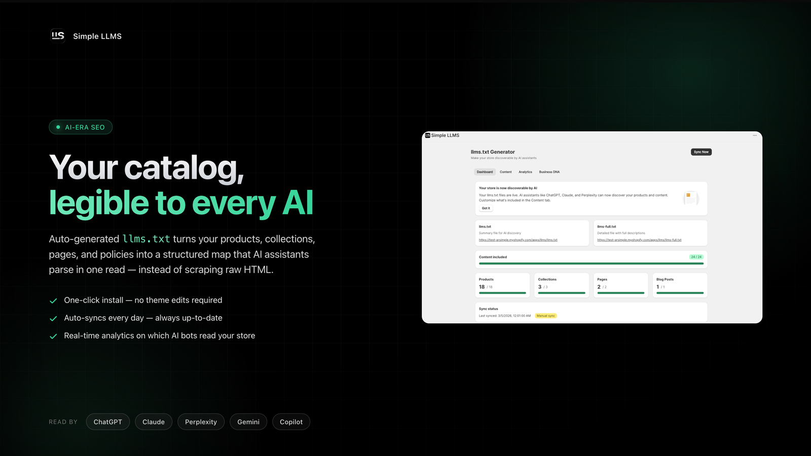
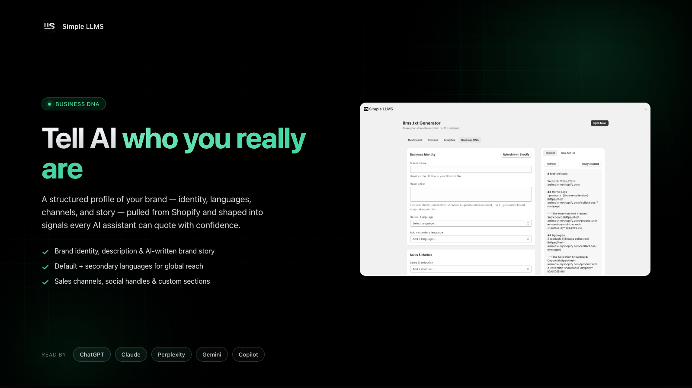
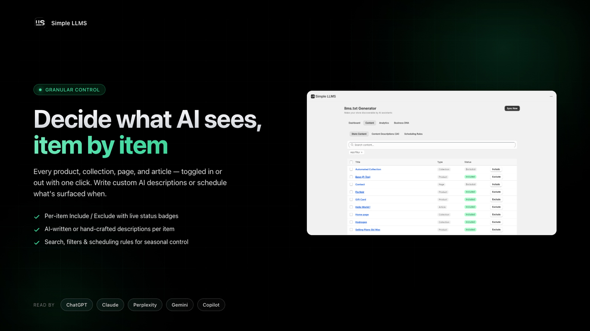
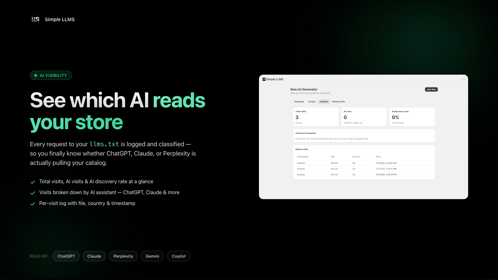

# Simple LLMS

**Your catalog, legible to every AI.**

A Shopify app that auto-generates `llms.txt` and `llms-full.txt` for any store — turning products, collections, pages, and policies into a structured map that AI assistants can parse in one read, instead of scraping raw HTML.

[**simple-llms.com**](https://simple-llms.com) · Built on Cloudflare Workers · Made by [ODN-io](https://github.com/oiseaudenuit)

---

## The problem

When a shopper asks ChatGPT, Claude, or Perplexity *"where can I buy [product]?"*, the AI does not crawl your beautifully designed Shopify storefront. It reads raw HTML — ads, navigation, theme markup, all of it — and gives up before it understands what you actually sell.

Simple LLMS auto-generates `llms.txt` and `llms-full.txt` for any Shopify store and serves them through the app proxy, so AI assistants get a clean, structured map of your catalog instead.

- One-click install — no theme edits, no copy-paste, no maintenance
- Auto-syncs every day — always reflects the current catalog
- Real-time analytics — see exactly which AI bots are reading your store

---

## Features

### 🧬 Business DNA — tell AI who you really are

A structured profile of your brand — identity, languages, channels, and story — pulled from Shopify and shaped into signals every AI assistant can quote with confidence.

- Brand identity, description & AI-written brand story
- Default + secondary languages for global reach
- Sales channels, social handles & custom sections

---

### 🎛️ Granular Control — decide what AI sees, item by item

Every product, collection, page, and article — toggled in or out with one click. Write custom AI descriptions, or schedule what's surfaced when.

- Per-item Include / Exclude with live status badges
- AI-written or hand-crafted descriptions per item
- Search, filters & scheduling rules for seasonal control

---

### 📊 AI Visibility — see which AI reads your store

Every request to your `llms.txt` is logged and classified — so you finally know whether ChatGPT, Claude, or Perplexity is actually pulling your catalog.

- Total visits, AI visits & AI discovery rate at a glance
- Visits broken down by AI assistant — ChatGPT, Claude, Perplexity, Gemini, Copilot
- Per-visit log with file, country & timestamp

---

## About

Simple LLMS started as an internal tool to make my own Shopify store readable to AI assistants — then turned into something every Shopify merchant will need as AI-driven shopping becomes the norm.

If you want to chat about the build, the AI-SEO space, or commerce + LLMs in general — [reach out](https://github.com/oiseaudenuit).

---

**[simple-llms.com](https://simple-llms.com)** · © 2026 ODN-io. All rights reserved.

